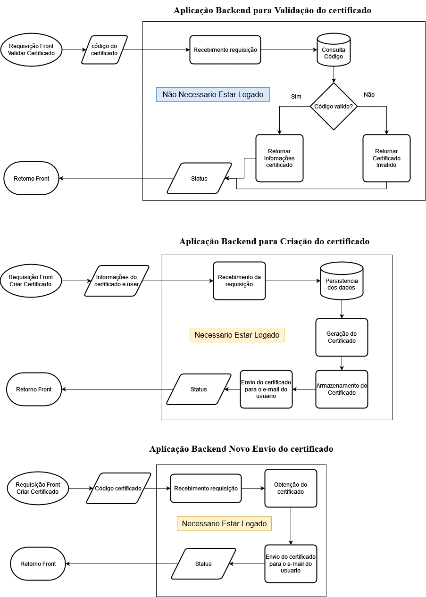

# Start Future Backend Logic

## About

Logic and Infra of Start Future

## How to Use

## installing

Clone This Repository:

```git clone https://github.com/StartFuture/start-future-backend.git```

Go to repository:
```cd start-future-backend```

Create virtual environment:

```bash
    python3 -m virtualenv venv
    source venv/bin/activate
```

Installing Requirements:
```pip install -r requirements.txt```

## Run

Open Your favorite terminal and run: ```uvicorn app.app:app --reload```

## Built With

* [ReportLab](https://www.reportlab.com/)
* [PyPDF2](https://pypi.org/project/PyPDF2/)
* [FAST-API](https://fastapi.tiangolo.com/)

## Contributing

* We use [SemVer](http://semver.org/) for versioning. For the versions available, see the [tags on this repository](https://github.com/StartFuture/start-future-backend/tags).

## Authors

* Lucas Nunes - Initial work

See also the list of [contributors](https://github.com/StartFuture/start-future-backend/contributors) who participated in this project.

## License

* This project is licensed under the GNU GENERAL PUBLIC LICENSE - see the [LICENSE](LICENSE) file for details

## Task-List

### Generic

* [ ] Create Basic Setup with Fast-API
* [ ] Test endpoints with Fast-API

### Forms

* [ ] Create MER Forms
* [ ] Create CRUD Forms
* [ ] Create routes 

### Certificate

* [ ] Prepare PDF app to generate certificate
* [ ] Create endpoints to generate certificate
* [ ] Test certificate endpoints
* [ ] Create authentication DB
* [ ] Connect with DB
* [ ] Create authentication (JWT) step with Fast-API
* [ ] Test authentication
* [ ] Deploy on EC2, ECS

## Diagram


